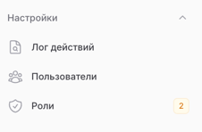
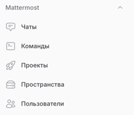
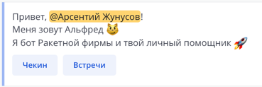
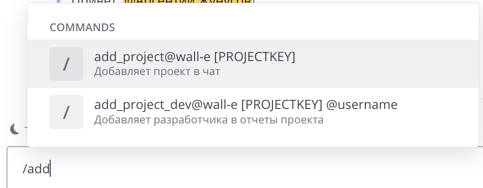
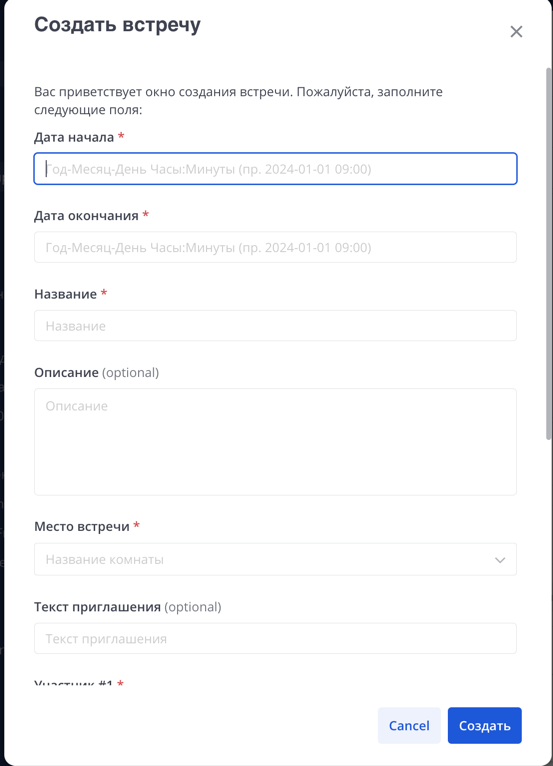
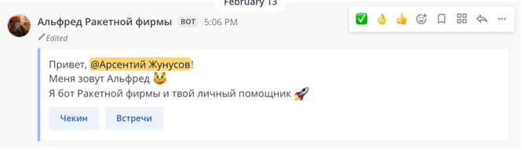

# Интеграция с Mattermost

## Приложение

### Структура

```text
app/                              # Основная директория приложения
│── Console/                      # Консольные команды
│   └── Mattermost/               # Команды для работы с Mattermost
│       ├── SyncChannelsCommand.php   # Команда для синхронизации каналов (чатов)
│       ├── SyncCommandCommand.php    # Команда для синхронизации команды
│       ├── SyncCommandsCommand.php   # Команда для синхронизации команд
│       ├── SyncTeamsCommand.php      # Команда для синхронизации пространств
│       ├── SyncUsersCommand.php      # Команда для синхронизации пользователей Mattermost
│── Contracts/                    # Контракты (интерфейсы)
│   └── Mattermost/               # Контракты для работы с Mattermost
│       ├── ActionContract.php         # Контракт для работы с Mattermost Action Hook
│       ├── DialogServiceContract.php  # Контракт для работы с Mattermost Dialog Hook
│       ├── CommandContract.php        # Контракт для работы с вызовами команд Mattermost
│       ├── CommandServiceContract.php # Контракт для работы с командами (CRUD) Mattermost
│       ├── PostServiceContract.php    # Контракт для работы с постами (сообщениями) Mattermost
│       ├── TeamServiceContract.php    # Контракт для работы с пространствами Mattermost
│       ├── UserServiceContract.php    # Контракт для работы с пользователями Mattermost
│── DTO/                          # Data Transfer Objects (объекты передачи данных)
│   └── Jenkins/                  # DTO для работы с запросами Jenkins Webhook
│── Enums/                        # Классы-перечисления
│   └── Jenkins/                  # Перечисления для работы с Jenkins Webhook
│── Exceptions/                    # Исключения
│   └── Mattermost/               # Исключения для работы с Mattermost
│       ├── ServiceException.php      # Базовое исключение для работы с Mattermost
│── Filament/                     # Ресурсы админки Filament
│── Handlers/                     # Обработчики событий
│   ├── Jenkins/                  # Обработчики для работы с Jenkins Webhook
│   └── Mattermost/               # Обработчики для работы с Mattermost
│       ├── SyncChannelsHandler.php   # Обработчик для синхронизации каналов (чатов)
│       ├── SyncCommandHandler.php    # Обработчик для синхронизации команды
│       ├── SyncCommandsHandler.php   # Обработчик для синхронизации команд
│       ├── SyncDataHandler.php       # Обработчик для синхронизации всех сущностей Mattermost
│       ├── SyncTeamsHandler.php      # Обработчик для синхронизации пространств Mattermost
│       ├── SyncUsersHandler.php      # Обработчик для синхронизации пользователей Mattermost
│── Http/                         # HTTP-слой приложения
│   ├── Controllers/              # Контроллеры
│   │   ├── Commands/             # Контроллеры для работы с командами
│   │   │   └── Mattermost/       # Контроллеры для Mattermost
│   │   │       ├── CommandController.php # Контроллер для работы с командами Mattermost
│   │   ├── Webhook/              # Контроллеры для работы с Webhook
│   │   │   ├── Jenkins/          # Контроллеры для работы с Jenkins Webhook
│   │   │   └── Mattermost/       # Контроллеры для работы с Mattermost Webhook
│   │   │       ├── ActionController.php  # Контроллер для работы с Mattermost Action Hook
│── Livewire/                     # Компоненты Livewire
│── Models/                       # Модели Eloquent
│   └── Mattermost/               # Модели для работы с Mattermost
│       ├── Channel.php           # Модель для работы с каналами (чатами)
│       ├── ChannelProject.php     # Модель для связи каналов с проектами
│       ├── Command.php           # Модель для работы с командами
│       ├── ProjectUser.php       # Модель для связи пользователей с проектами
│       ├── Team.php              # Модель для работы с пространствами
│       ├── User.php              # Модель для работы с пользователями
│── Policies/                     # Политики (доступ) для админки Filament
│── Providers/                    # Сервис-провайдеры
│   └── Mattermost/               # Провайдеры для Mattermost
│       ├── ServiceProvider.php       # Провайдер для работы с сервисами Mattermost
│── Services/                     # Сервисный слой
│   └── Mattermost/               # Сервисы для работы с Mattermost
│       ├── ChannelService.php    # Сервис для работы с каналами (чатами) Mattermost
│       ├── CommandService.php    # Сервис для работы с командами Mattermost
│       ├── DialogService.php     # Сервис для работы с диалогами (модальными окнами) Mattermost
│       ├── PostService.php       # Сервис для работы с постами (сообщениями) Mattermost
│       ├── TeamService.php       # Сервис для работы с пространствами Mattermost
│       ├── UserService.php       # Сервис для работы с пользователями Mattermost
│── Traits/                       # Трейты (модули переиспользуемого кода)
│   ├── Mattermost/               # Трейты для работы с Mattermost
│   │   ├── CallEndpointMethod.php # Трейт для вызова методов эндпоинтов Mattermost
│   ├── ConfigTrait.php           # Трейт для работы с конфигурацией
│   ├── LocalizationTrait.php     # Трейт для работы с локализацией
│   ├── ResponseTrait.php         # Трейт для работы с HTTP-ответами
```

### Модели

- [Mattermost/Channel.php](./app/Models/Mattermost/Channel.php) - таблица: `mattermost_channels`, Модель для работы с каналами (чатами)
- [Mattermost/ChannelProject.php](./app/Models/Mattermost/ChannelProject.php) - таблица: `mattermost_channels_projects`, Модель для связи каналов с проектами
- [Mattermost/Command.php](./app/Models/Mattermost/Command.php) - таблица: `mattermost_commands`, Модель для работы с командами
- [Mattermost/ProjectUser.php](./app/Models/Mattermost/ProjectUser.php) - таблица: `mattermost_projects_users`, Модель для связи пользователей с проектами
- [Mattermost/Team.php](./app/Models/Mattermost/Team.php) - таблица: `mattermost_teams`, Модель для работы с пространствами
- [Mattermost/User.php](./app/Models/Mattermost/User.php) - таблица: `mattermost_users`, Модель для работы с пользователями

### Модули в админке

- Настройки: Лог действий, Пользователи, Роли



- Mattermost: Чаты (Channel), Команды (Command), Проекты (ChannelProject), Пространства (Team), Пользователи (User)



### Конфигурация

> Конфигурация в файле [config/mattermost.php](config/mattermost.php)

```php
<?php

return [
    /*
    |--------------------------------------------------------------------------
    | Default Mattermost Server Name
    |--------------------------------------------------------------------------
    |
    | Here you cam specify which server you wish to use as your
    | default Mattermost server.
    |
    */

    'default' => env('MATTERMOST_SERVER', 'login'),

    /*
    |--------------------------------------------------------------------------
    | Mattermost Servers
    |--------------------------------------------------------------------------
    |
    | Here you can configure a list of different Mattermost servers
    | to use within your application.
    |
    | You can authenticate in two ways: passing a Bearer Token or
    | passing Username and Password. The allowed values for the "auth"
    | option are: "default", "bearer".
    |
    */

    'servers' => [
        // Подключение к Mattermost, используя следующие параметры
        'login' => [
            'auth' => env('MATTERMOST_AUTH', 'login'),
            'host' => env('MATTERMOST_HOST', 'localhost'),
            'login' => env('MATTERMOST_LOGIN', 'login'),
            'password' => env('MATTERMOST_PASSWORD', 'password'),
            'api' => env('MATTERMOST_API', '/api/v4'),
            'timeout' => env('MATTERMOST_TIMEOUT', 5),
        ],
    ],
];
```

### Драйвер

Для работы с Mattermost используется драйвер [MattermostDriver](https://github.com/arsentiy-byte/mattermost-driver)

```shell
composer require arsentiyz/mattermost-driver
```

```shell
php artisan vendor:publish
```

### Контракты (Интерфейсы)

В контрактах заложены методы, которые используются для работы с Mattermost. Реализация контрактов находится в [`Services/Mattermost`](./app/Services/Mattermost). Инициализация контрактов происходит в [`Providers/Mattermost/ServiceProvider.php`](./app/Providers/Mattermost/ServiceProvider.php) 

#### Кнопки в постах ([`ActionContract.php`](./app/Contracts/Mattermost/ActionContract.php))



Выполнение действия кнопки в постах происходит через вебхук [`ActionController.php`](./app/Http/Controllers/Webhook/Mattermost/ActionController.php), который использует контракт [`ActionContract.php`](./app/Contracts/Mattermost/ActionContract.php)

```php
/** @var \App\Http\Requests\Mattermost\ActionHookRequest $request */
$request = app()->make(\App\Http\Requests\Mattermost\ActionHookRequest::class);

/** @var \App\Contracts\Mattermost\ActionContract $contract */
$contract = app()->make(\App\Contracts\Mattermost\ActionContract::class);

$contract->do($request->getDto());
```

#### Открытие личного чата с пользователями в Mattermost ([`ChannelServiceContract.php`](./app/Contracts/Mattermost/ChannelServiceContract.php))

Метод `direct` возвращает новый/текущий чат с пользователями (`senderId` - отправитель, `receiverId` - получатель)

```php
$senderId = 'senderId'; // ID пользователя в Mattermost
$receiverId = 'receiverId'; // ID пользователя в Mattermost

/** @var \App\Contracts\Mattermost\ChannelServiceContract $service */
$service = app()->make(\App\Contracts\Mattermost\ChannelServiceContract::class);

$channel = $service->direct($senderId, $receiverId);

$channel->id; // ID чата
```

#### Выполнение команды ([`CommandServiceContract.php`](./app/Contracts/Mattermost/CommandServiceContract.php))



Выполнение команды в чате происходит через вебхук [`CommandController.php`](./app/Http/Controllers/Commands/Mattermost/CommandController.php), который использует контракт [`CommandContract.php`](./app/Contracts/Mattermost/CommandContract.php)

```php
/** @var \App\Http\Requests\Mattermost\CommandRequest $request */
$request = app()->make(\App\Http\Requests\Mattermost\CommandRequest::class);

/** @var \App\Contracts\Mattermost\CommandContract $contract */
$contract = app()->make(\App\Contracts\Mattermost\CommandContract::class);

$contract->call($request->getDto());
```

#### Управление командами ([`CommandServiceContract.php`](./app/Contracts/Mattermost/CommandServiceContract.php))

```php
use Arsentiyz\MattermostDriver\Requests\Command\CreateRequest;
use Arsentiyz\MattermostDriver\Enums\Command\Method;
use Arsentiyz\MattermostDriver\Requests\Command\IndexRequest;
use Arsentiyz\MattermostDriver\Requests\Command\UpdateRequest;

/** @var \App\Contracts\Mattermost\CommandServiceContract $service */
$service = app()->make(\App\Contracts\Mattermost\CommandServiceContract::class);

// Создание команды
$command = $service->createCommand(new CreateRequest(
    teamId: 'teamId', // ID пространства в Mattermost
    method: Method::POST, // HTTP метод вызова команды через вебхук
    trigger: 'command', // Триггер команды
    url: 'http://localhost', // URL вебхука для вызова команды
));

// Редактирование команды
$service->updateCommand(new UpdateRequest(
    id: $command->id, // ID команды в Mattermost
    token: $command->token, // Токен команды
    createAt: $command->createAt, // Дата создания команды
    updateAt: $command->updateAt, // Дата обновления команды
    deleteAt: $command->deleteAt, // Дата удаления команды
    creatorId: $command->creatorId, // ID создателя команды
    teamId: $command->teamId, // ID пространства в Mattermost
    trigger: $command->trigger, // Триггер команды
    method: $command->method, // HTTP метод вызова команды через вебхук
    username: $command->username, // Имя пользователя в Mattermost
    iconUrl: $command->iconUrl, // URL иконки пользователя в Mattermost
    autoComplete: $command->autoComplete, // Автозаполнение команды
    autoCompleteDesc: $command->autoCompleteDesc, // Описание автозаполнения команды
    autoCompleteHint: $command->autoCompleteHint, // Подсказка автозаполнения команды
    displayName: $command->displayName, // Отображаемое имя команды
    description: $command->description, // Описание команды
    url: $command->url, // URL вебхука для вызова команды
));

// Получение команд пространства
$commands = $service->getCommands(new IndexRequest(
    teamId: 'teamId', // ID пространства в Mattermost
    customOnly: false, // Получить только пользовательские команды
));

// Получение команды
$command = $service->showCommand($command->id);

// Удаление команды
$service->deleteCommand($command->id);
```

#### Вызов диалога (модалки) ([`DialogServiceContract.php`](./app/Contracts/Mattermost/DialogServiceContract.php))



Вызов диалога происходит через вебхук и использует контракт [`DialogServiceContract.php`](./app/Contracts/Mattermost/DialogServiceContract.php)

```php
/** @var \App\Http\Requests\Mattermost\DialogRequest $request */
$request = app()->make(\App\Http\Requests\Mattermost\DialogRequest::class);

/** @var \App\Contracts\Mattermost\DialogServiceContract $contract */
$contract = app()->make(\App\Contracts\Mattermost\DialogServiceContract::class);

$contract->open($request->getDto());
```

#### Управление постами (сообщениями) ([`PostServiceContract.php`](./app/Contracts/Mattermost/PostServiceContract.php))



```php
use Arsentiyz\MattermostDriver\Collections\AttachmentCollection;
use Arsentiyz\MattermostDriver\Entities\Props;
use Arsentiyz\MattermostDriver\Requests\Post\CreateRequest;
use Arsentiyz\MattermostDriver\Requests\Post\UpdateRequest;

/** @var \App\Contracts\Mattermost\PostServiceContract $contract */
$contract = app()->make(\App\Contracts\Mattermost\PostServiceContract::class);

// Создание поста
$post = $contract->createPost(new CreateRequest(
    setOnline: true, // Изменить статус пользователя на онлайн
    channelId: 'channelId', // ID канала
    message: 'Text message', // Текст сообщения
    rootId: 'rootId', // ID родительского сообщения
    fileIds: ['fileId1', 'fileId2'], // ID файлов
    props: new Props(
        props: [ // Дополнительные свойства
            'key1' => 'value1',
            'key2' => 'value2',
        ],
        attachmentCollection: AttachmentCollection::make(), // Коллекция вложений (кнопок, файлов, картинок)
    )
));

// Редактирование поста
$contract->updatePost(new UpdateRequest(
    id: $post->id, // ID поста в Mattermost
    isPinned: true, // Закрепить пост
    message: 'Updated message', // Текст сообщения
    hasReactions: false, // Удалить реакции
    props: new Props(
        props: [ // Дополнительные свойства
            'key1' => 'value1',
            'key2' => 'value2',
        ],
        attachmentCollection: AttachmentCollection::make(), // Коллекция вложений (кнопок, файлов, картинок)
    )
));
```

#### Управление пространствами ([`TeamServiceContract.php`](./app/Contracts/Mattermost/TeamServiceContract.php))

```php
use Arsentiyz\MattermostDriver\Requests\Team\ChannelsRequest;
use Arsentiyz\MattermostDriver\Requests\Team\IndexRequest;

/** @var \App\Contracts\Mattermost\TeamServiceContract $service */
$service = app()->make(\App\Contracts\Mattermost\TeamServiceContract::class);

// Получение пространств
$teams = $service->getTeams(new IndexRequest(
    page: 0, // Номер страницы
    perPage: 60, // Количество элементов на странице
    includeTotalCount: true, // Включить подсчет общего количества элементов
    excludePolicyConstrained: true, // Исключить пространства, ограниченные политикой
));

// Получение публичных каналов (чатов)
$publicChannels = $service->getPublicChannels(new ChannelsRequest(
    teamId: 'teamId', // ID пространства
    page: 0, // Номер страницы
    perPage: 60, // Количество элементов на странице
));

// Получение приватных каналов (чатов)
$privateChannels = $service->getPrivateChannels(new ChannelsRequest(
    teamId: 'teamId', // ID пространства
    page: 0, // Номер страницы
    perPage: 60, // Количество элементов на странице
));
```

#### Управление пользователями ([`UserServiceContract.php`](./app/Contracts/Mattermost/UserServiceContract.php))

```php
use Arsentiyz\MattermostDriver\Requests\User\IndexRequest;
use Arsentiyz\MattermostDriver\Enums\Post\Sort;

/** @var \App\Contracts\Mattermost\UserServiceContract $service */
$service = app()->make(\App\Contracts\Mattermost\UserServiceContract::class);

// Получение пользователей
$users = $service->index(new IndexRequest(
    page: 0, // Номер страницы
    perPage: 60, // Количество элементов на странице
    inTeam: 'teamId', // ID пространства
    notInTeam: 'teamId', // ID пространства
    inChannel: 'channelId', // ID канала
    notInChannel: 'channelId', // ID канала
    inGroup: 'groupId', // ID группы
    groupConstrained: true, // Исключить пользователей, ограниченных группой
    withoutTeam: false, // Исключить пользователей без пространства
    active: true, // Активные пользователи
    inactive: true, // Неактивные пользователи
    role: 'role', // Роль
    sort: Sort::CREATE_AT, // Сортировка
    roles: ['role1', 'role2'], // Роли
    channelRoles: ['channelRole1', 'channelRole2'], // Роли канала
    teamRoles: ['teamRole1', 'teamRole2'], // Роли пространства
));

// Получение всех пользователей в пространстве
$allUsers = $service->all(
    inTeamId: 'teamId', // ID пространства
    notInTeamId: 'teamId', // ID пространства
);
```

## Инфраструктура

### Зависимости

- PHP 8.2
- Laravel 11.9
- PostgreSQL Latest
- Nginx Latest Alpine

### Инструменты

#### Линтеры

##### Laravel Pint для форматирования и стандартизации кода

> Используется библиотека [Laravel Pint](https://laravel.com/docs/11.x/pint)
> Конфигурация в [pint.json](../../pint.json)

- Для проверки кода запускается команда:
```shell
vendor/bin/pint --test --dirty --config pint.json
```

- Для форматирования кода:
```shell
vendor/bin/pint --config pint.json
```

##### Анализатор кода
> Используется библиотека [PHPStan](https://phpstan.org/)
> Конфигурация в [phpstan.neon](../../phpstan.neon)

- Для запуска анализатора используется команда:
```shell
vendor/bin/phpstan analyse -c phpstan.neon
```

#### API Документация Swagger

> Используется библиотека [L5-Swagger](https://github.com/DarkaOnLine/L5-Swagger)
>
> Конфиги в файле [l5-swagger.php](../../config/l5-swagger.php)
>
> Базовый класс контроллера в [Controller](../../app/Http/Controllers/Controller.php)
>
> UI документации доступен по пути http://blog.localhost/api/documentation
>
> JSON файл доступен по пути http://blog.localhost/docs/api-docs.json
>
> Сама документация генерируется в директории [storage/api-docs/api-docs.json](../../storage/api-docs/api-docs.json)

Для генерации документации используется команда:

```shell
php artisan l5-swagger:generate
```

#### Тесты

> Используется стандартная библиотека [PHPUnit](https://phpunit.de/index.html)
>
> Конфигурация в файле [phpunit.xml](../../phpunit.xml)
>
> Unit тесты в директории [Unit](../../tests/Unit)
> Feature тесты в директории [Feature](../../tests/Feature)
>
> Так же применяются проверки и подготовка тестов к запуску (логика описана в трейте [CreatesApplication](../tests/CreatesApplication.php)).
>
> Базовый класс тестов в [TestCase](../../tests/TestCase.php)

Для запуска тестов используется следующая команда:

```shell
vendor/bin/phpunit
```
